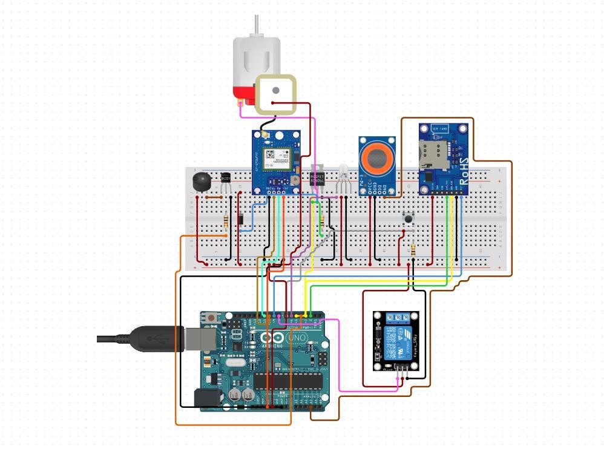

# Alcohol Detection System 🚗🚨  
*Author: [Yash Sharma](https://github.com/yashsharma-007)*  

---

## Overview  
This project is a **smart alcohol detection system** designed to enhance road safety by detecting alcohol levels in a driver. The system is equipped with sensors to detect alcohol concentration, automatically stop the vehicle by controlling the motor, and send an alert SMS with the driver's GPS location to a predefined phone number.  

This solution aims to prevent drunk driving accidents by integrating hardware components like GSM, GPS, and alcohol sensors with software logic.

---

## Features  
- **Alcohol Detection**: Uses an MQ-3 alcohol sensor to monitor alcohol levels.  
- **Automatic Vehicle Stopping**: Controls the motor to stop the car immediately when alcohol is detected.  
- **Alert System**: Activates a buzzer and sends an SMS with the GPS location of the vehicle in case of detection.  
- **Failsafe Design**: The vehicle remains stopped until alcohol levels drop below the threshold.  

---

## Components Used  
| **Component**          | **Description**                                                                 |
|-------------------------|---------------------------------------------------------------------------------|
| Arduino UNO             | Microcontroller used to control all components.                                |
| MQ-3 Alcohol Sensor     | Detects alcohol concentration in the air.                                      |
| GSM Module (SIM800/900) | Sends SMS alerts with the driver's location.                                   |
| TinyGPS++ Module        | Extracts GPS coordinates for location tracking.                                |
| Relay Module            | Cuts off the motor's power to stop the vehicle when alcohol is detected.       |
| Motor                   | Represents the car engine, stops when alcohol is detected.                     |
| Buzzer                  | Provides an audible alert when alcohol is detected.                            |
| Power Supply            | 5V DC power supply for Arduino and other components.                           |
| Jumper Wires            | Connects components on the breadboard.                                         |

---

## Circuit Diagram  
  
*(Replace `circuit_diagram.jpg` with the actual path to your circuit diagram image in the project folder.)*  

---

## Working Principle  
1. **Initialization**:  
   - The system initializes the GSM and GPS modules and sends an SMS indicating that the system is ready.  

2. **Alcohol Detection**:  
   - The MQ-3 sensor continuously monitors the alcohol level in the driver's vicinity.
   - The sensor output is averaged over multiple samples to ensure accuracy.  

3. **Vehicle Stopping Mechanism**:  
   - If the alcohol level exceeds the predefined threshold:
     - The relay module immediately disconnects the motor from the power supply, stopping the vehicle.  
     - A buzzer is activated to provide an audible alert.  

4. **Alert Mechanism**:  
   - Along with stopping the vehicle, an SMS is sent to a predefined phone number containing a warning and the GPS location of the vehicle.  

5. **Failsafe Reset**:  
   - The system resets when alcohol levels drop below the threshold, allowing the motor to start again.  

---

## Installation and Setup  
### **Hardware Setup**  
1. Connect the MQ-3 alcohol sensor to the analog pin `A0` of the Arduino.  
2. Connect the GSM module's TX and RX pins to pins `6` and `7` of the Arduino, respectively.  
3. Connect the GPS module's TX and RX pins to pins `10` and `11` of the Arduino, respectively.  
4. Wire the relay module to pin `9` and connect it to control the motor power supply.  
5. Connect the buzzer to pin `8` of the Arduino.  
6. Power all components using a suitable 5V DC power supply.  

### **Software Setup**  
1. Install the required Arduino libraries:
   - `TinyGPS++`
   - `SoftwareSerial` (comes pre-installed).  
2. Replace the placeholder phone number (`+91 YOUR NUMBER`) in the code with your actual phone number.  
3. Upload the code to the Arduino using the Arduino IDE.  

---

## Sample Output  
- **SMS Alert**:  
WARNING: Driver is intoxicated! Vehicle stopped. Location: Latitude: 28.7041, Longitude: 77.1025

markdown
Copy code

- **Serial Monitor Output**:  
System Initialized. Average Alcohol Level: 350 GPS LOCATION NOT FOUND WARNING: Driver is intoxicated! Vehicle stopped.

markdown
Copy code

---

## Circuit Diagram Description  
### **Connections**:  
1. **Alcohol Sensor**:  
 - VCC → 5V  
 - GND → GND  
 - OUT → A0 (Analog Pin)  

2. **GSM Module**:  
 - VCC → 5V  
 - GND → GND  
 - RX → Pin 6  
 - TX → Pin 7  

3. **GPS Module**:  
 - VCC → 5V  
 - GND → GND  
 - RX → Pin 10  
 - TX → Pin 11  

4. **Relay Module**:  
 - IN → Pin 9  
 - VCC → 5V  
 - GND → GND  
 - Connect to the motor to control its power supply.  

5. **Motor**:  
 - Controlled through the relay module, stopping when alcohol is detected.  

6. **Buzzer**:  
 - Positive → Pin 8  
 - Negative → GND  

---

## Future Scope  
1. **Wi-Fi Integration**:  
 - Use ESP8266 or NodeMCU for cloud-based alerts and monitoring.  

2. **Mobile App**:  
 - Develop an app to receive real-time updates and alerts.  

3. **Advanced Motors**:  
 - Use DC or stepper motors for more realistic vehicle simulations.  

4. **Battery Backup**:  
 - Integrate a backup battery to ensure functionality during power failure.  

---

## License  
This project is licensed under the [MIT License](LICENSE).  

---

## Author  
**[Yash Sharma](https://github.com/yashsharma-007)**  
Connect with me for more such projects!  

---

